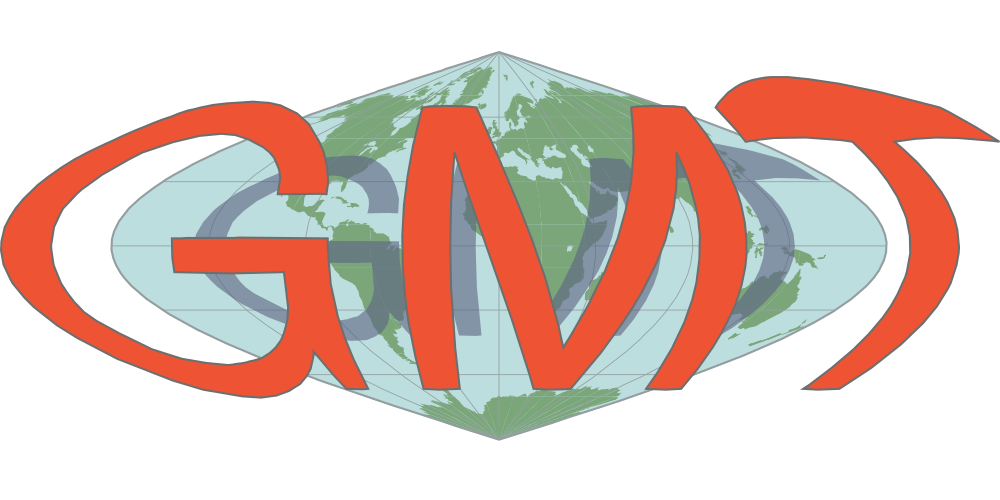
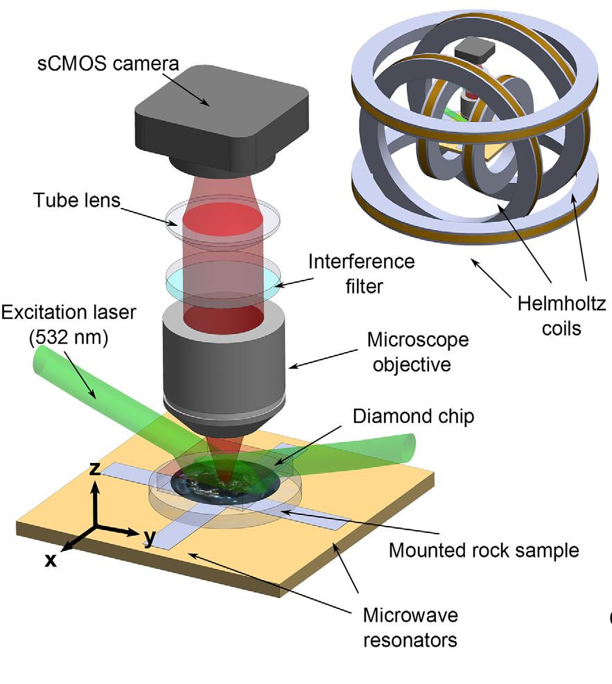
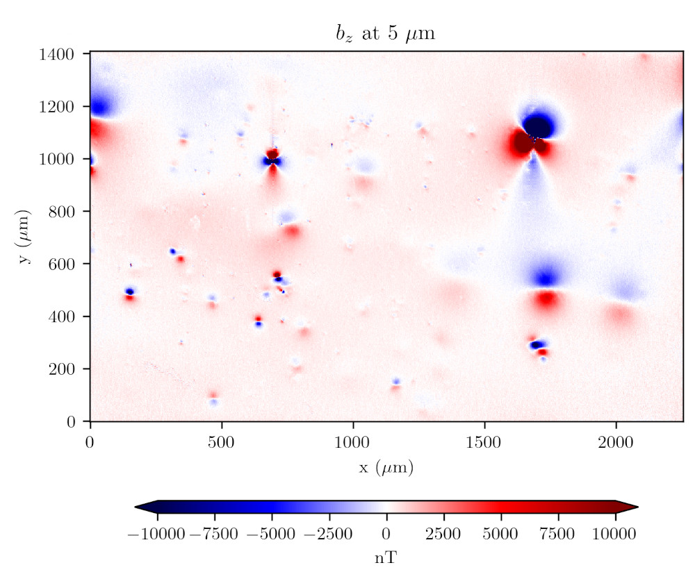
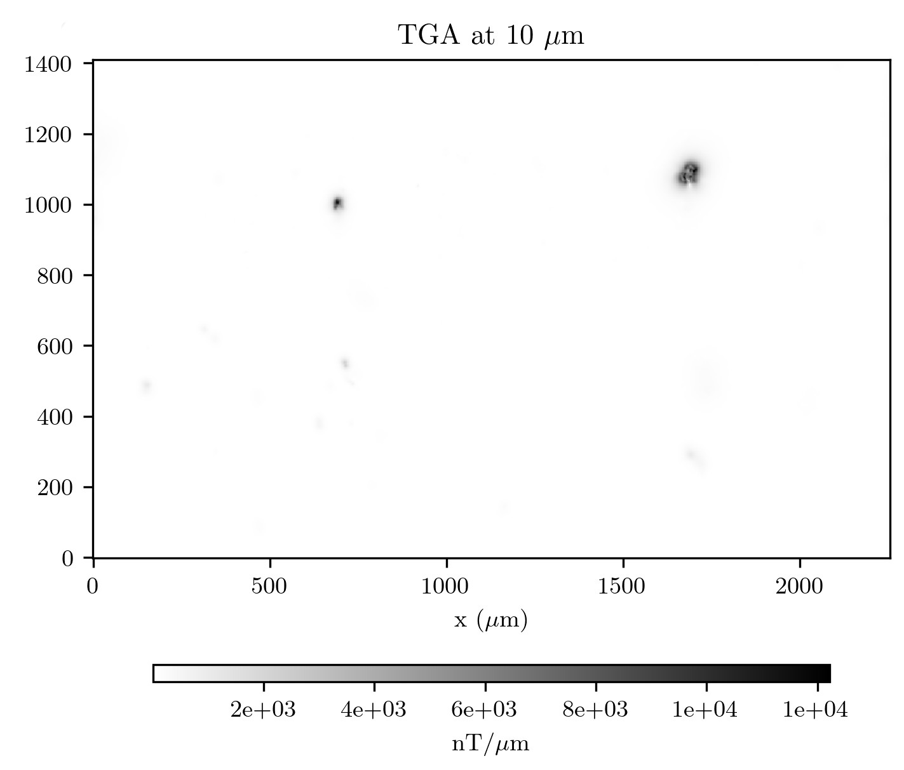
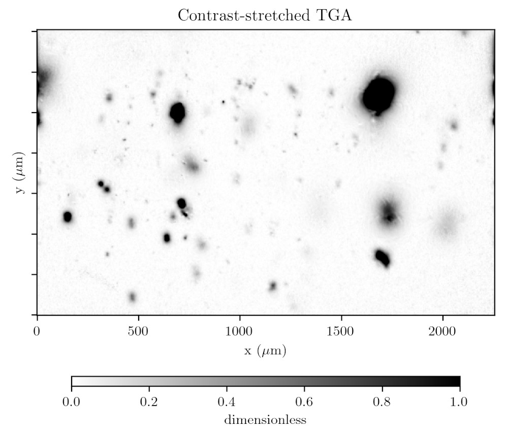
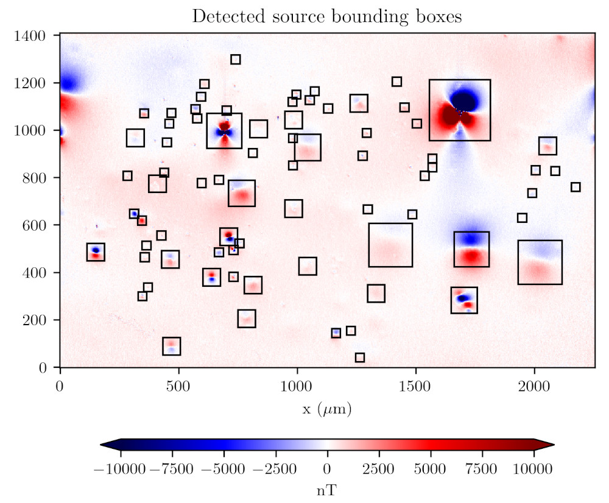
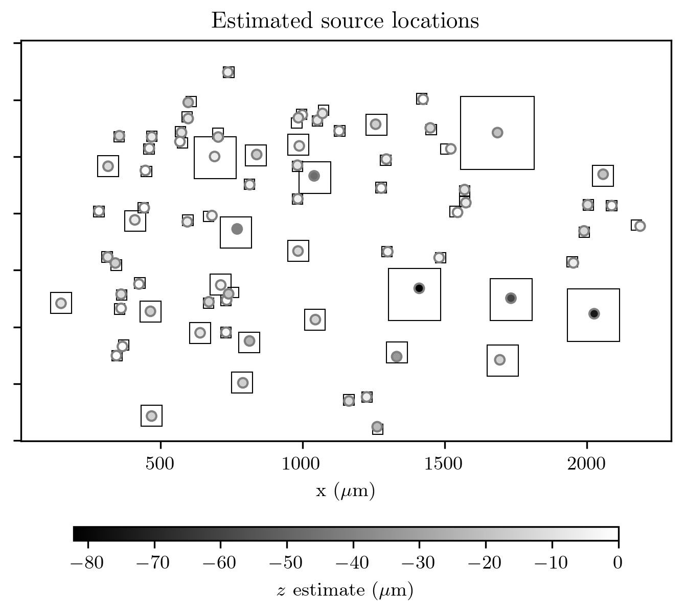
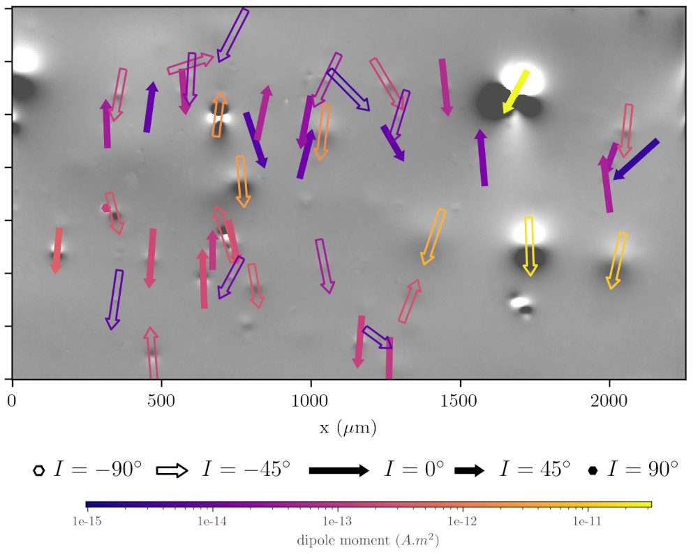
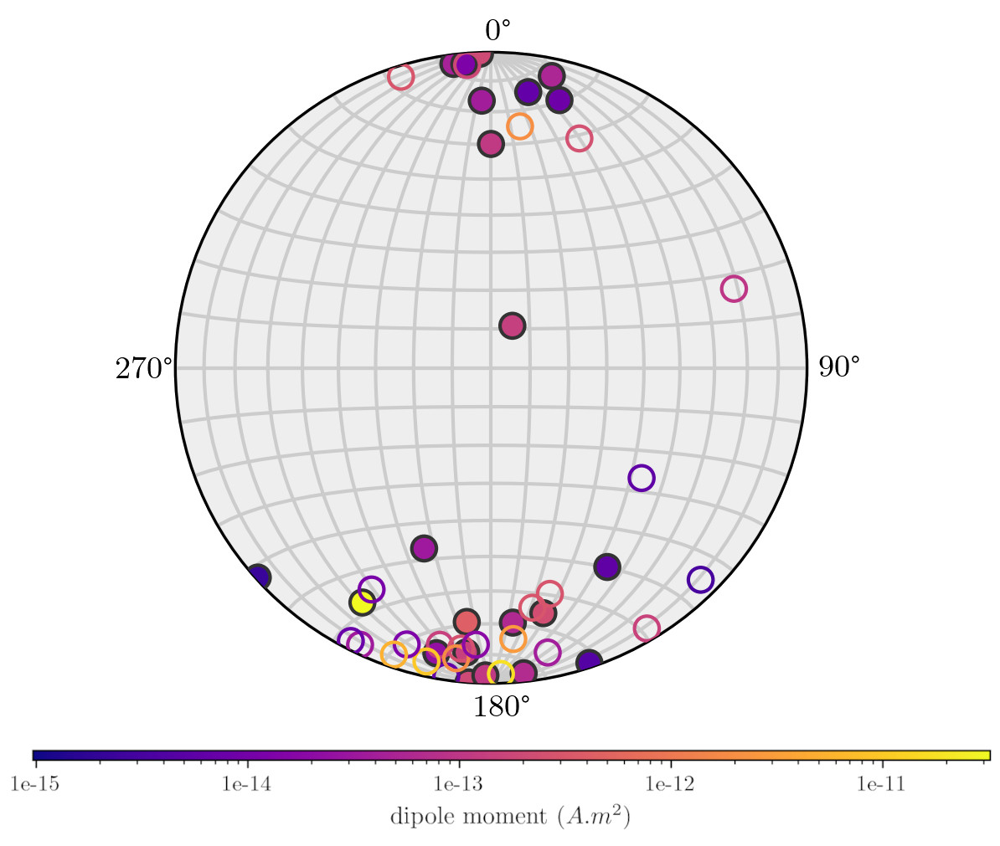

<!--
-------------------------------------------------------------------------------
This file defines the contents of each slide.
The reveal.js configuration can be found in index.html
-------------------------------------------------------------------------------
-->

<!-- .slide: class="slide-title" data-background-image="assets/title-slide.svg" data-background-color="#000000" data-background-size="contain" -->

<!-- Place the content at the bottom of the slide -->

<h1 id="talk-title">
  Campos magnéticos,  de escala microscópica   a continental
</h1>

  <a href="https://www.leouieda.com" id="talk-speaker">Leonardo Uieda</a>

<!-- Place location and date side-by-side with affiliation logos -->

<i class="fa fa-calendar-alt" style="margin: 0 10px 0 0"></i>
21 Novembro 2023

Por Dentro Da Geofísica / IAG-USP

<!-- Permission to reuse and CC-BY license logo -->
<i class="fa fa-camera" style="margin: 0 10px 0 0"></i>
Feel free to screenshot/share/reuse this presentation

<a href="https://creativecommons.org/licenses/by/4.0/"><i class="fab fa-creative-commons"></i><i class="fab fa-creative-commons-by" style="margin: 0 10px 0 2px"></i>CC-BY 4.0 License</a>

<!-- Add logos here. Need these wrappers to align them to the bottom right -->

  
  
  

===============================================================================

<!-- .slide: class="slide-transition" -->

# Conheça seu palestrante

===============================================================================

<!-- .slide: data-background-video="assets/brasil-sao-paulo-rio.mp4" data-background-size="contain" data-background-color="#000000" -->

Bacharelado (USP) | Mestrado e Doutorado (Observatório Nacional)

===============================================================================

<!-- .slide: data-background-image="assets/paleomagnetism-field-work.jpg" data-background-size="contain"  -->

IC em paleomagnetismo (orientador Manoel D'Agrella)

===============================================================================

Programas em C para modelagem grav na esfera

[`tesseroids.leouieda.com`](https://tesseroids.leouieda.com)

IC \#2 + TCC em gravimetria (orientadora Naomi Ussami)

===============================================================================

<video style="width: auto; height: 100%" muted data-autoplay>
<source data-src="assets/planting-inversion.mp4" type="video/mp4"/>
</video>

Mestrado e Doutorado em inversão (orientadora Valéria C.F. Barbosa)
 
Método de plantação para inversão 3D ([Uieda & Barbosa, 2012](https://doi.org/10.1190/geo2011-0388.1))

===============================================================================

<!-- .slide: data-background-image="assets/fatiando-banner.svg" data-background-size="contain" data-background-color="#000000" -->

**Fatiando a Terra**

Bibliotecas em Python para modelagem, inversão e processamento

[www.fatiando.org](https://www.fatiando.org)

===============================================================================

<!-- .slide: data-background-video="assets/seismic-waves-demo.mp4" data-background-size="contain" data-background-color="#000000" -->

Ensinando geofísica na geologia da UERJ com Python + Jupyter + Fatiando

===============================================================================

<!-- .slide: data-background-video="assets/run-away-to-hawaii.mp4" data-background-size="contain" data-background-color="#000000" -->

Professor Visitante na University of Hawaiʻi at Mānoa

===============================================================================

Programas em C muito utilizados na geofísica (processamento e mapas)

Fui para criar o **PyGMT**

[www.pygmt.org](https://www.pygmt.org)

IC \#2 + TCC em gravimetria (orientadora Naomi Ussami)

===============================================================================

<!-- .slide: data-background-image="assets/uh-manoa.jpg" data-background-size="contain"  -->

Vista da minha sala na UH em direção ao vale de Manoa (sempre tinha um arco-íris)

===============================================================================

<!-- .slide: data-background-video="assets/hawaii-to-liverpool.mp4" data-background-size="contain" data-background-color="#000000" -->

Fui para a University of Liverpool com o cargo de Lecturer in Geophysics

===============================================================================

<!-- .slide: data-background-video="assets/remote-teaching-demo.mp4" data-background-size="contain" data-background-color="#000000" -->

Aprendendo a ser YouTuber durante a pandemia

===============================================================================

<!-- .slide: data-background-video="assets/liverpool-to-usp.mp4" data-background-size="contain" data-background-color="#000000" -->

Em 2023, voltei para o IAG-USP como Professor Doutor no Departamento de Geofísica

===============================================================================

<!-- .slide: class="slide-transition" -->

# Voltando ao tema da palestra

Campos magnéticos, de escala microscópica a continental

===============================================================================

<i class="fas fa-microscope"></i>

**Aluno:** Gelson F. Souza Junior
 
**Colaboradores:** Ricardo Trindade, Roger Fu, Janine Carmo

===============================================================================

<!-- .slide: data-background-image="assets/paleomagnetic-rock-sample.jpg" data-background-size="contain" data-background-color="#000000" -->

Amostra de rocha para uso em paleomagnetismo

===============================================================================

<!-- .slide: data-background-image="assets/classic-molspin-magnetometer.jpg" data-background-size="contain" -->

Magnetômetro que eu usei durante minha IC em paleomagnetismo

===============================================================================

Quantum Diamond Microscope (QDM).
Fonte: [Glenn et al. (2017)](https://doi.org/10.1002/2017GC006946)

===============================================================================

Fonte: [Souza Junior et al. (2023)](https://doi.org/10.31223/X5QD5Z) (CC-BY)

===============================================================================

Fonte: [Souza Junior et al. (2023)](https://doi.org/10.31223/X5QD5Z) (CC-BY)

===============================================================================

Fonte: [Souza Junior et al. (2023)](https://doi.org/10.31223/X5QD5Z) (CC-BY)

===============================================================================

Fonte: [Souza Junior et al. (2023)](https://doi.org/10.31223/X5QD5Z) (CC-BY)

===============================================================================

Fonte: [Souza Junior et al. (2023)](https://doi.org/10.31223/X5QD5Z) (CC-BY)

===============================================================================

Fonte: [Souza Junior et al. (2023)](https://doi.org/10.31223/X5QD5Z) (CC-BY)

===============================================================================

Fonte: [Souza Junior et al. (2023)](https://doi.org/10.31223/X5QD5Z) (CC-BY)

===============================================================================

<i class="fas fa-globe-americas"></i>

**Aluna:** India Uppal
 
**Colaboradores:** Richard Holme, Vanderlei C. Oliveira Jr.

===============================================================================

<!-- .slide: class="slide-transition" -->

# Resumindo

===============================================================================

**Afim de uma IC?**

Venha conversar!

===============================================================================

<!-- .slide: class="slide-contact" data-background-image="assets/contact-slide.svg" data-background-size="contain" data-background-color="#000000" -->

<i class="fas fa-comments"></i>
 
Contact:
<a href="https://www.leouieda.com">www.leouieda.com</a>

<i class="fab fa-github"></i>
 
Source code for this presentation:
 
[github.com/leouieda/por-dentro-geofisica-2023](https://github.com/leouieda/por-dentro-geofisica-2023)

<i class="fab fa-creative-commons"></i><i class="fab fa-creative-commons-by"></i>
 
Unless otherwise noted,
the contents of this presentation are
licensed under the
 
[Creative Commons Attribution 4.0 International License](https://creativecommons.org/licenses/by/4.0/).

The background image is a Landsat 9 scene of the city of São Paulo, Brazil,
showing the USP campus in the center.

